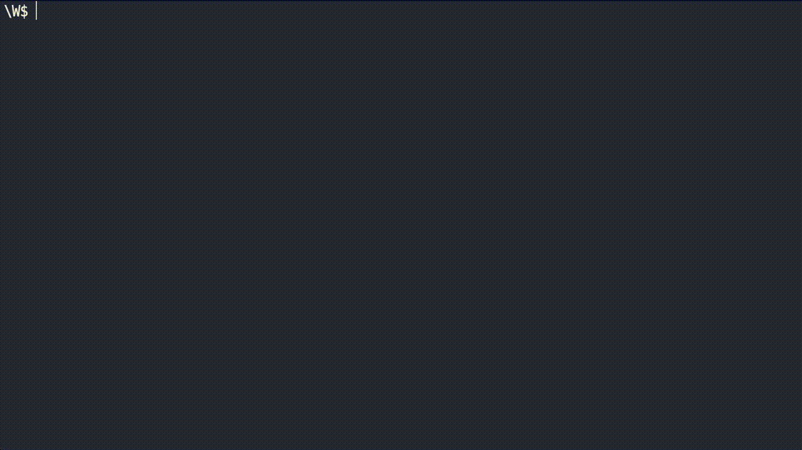

<h1 align="center">Language Guesser App</h1>
<h2 align="center">Project Screenshot<h2>
<p align="center">
  </img>
</p>

## How to install
Download, open or nativate to using your terminal/command line, run the following command to install
```command
npm install
``

## Usage 
Launch app with following command
```command 
npm index.js
```

Then supply some text for the application to guess the language
## Description

This is a Nodejs application that attempts to identidy a language based on provided text.

## Built with 

Javascript
Node.js


## What I learnt 

This is my first Node.js application, during a web development course created by Colt Steel he asks that you create this application using npm modules and node.js

## Authors

<a href="https://github.com/CtrlAltSudo">CtrlAltSudo</a>.

## Acknowledgments

Colt is a great teacher, he explains everything in a way I can easily(most of the time) understand, and of course the npm community! 